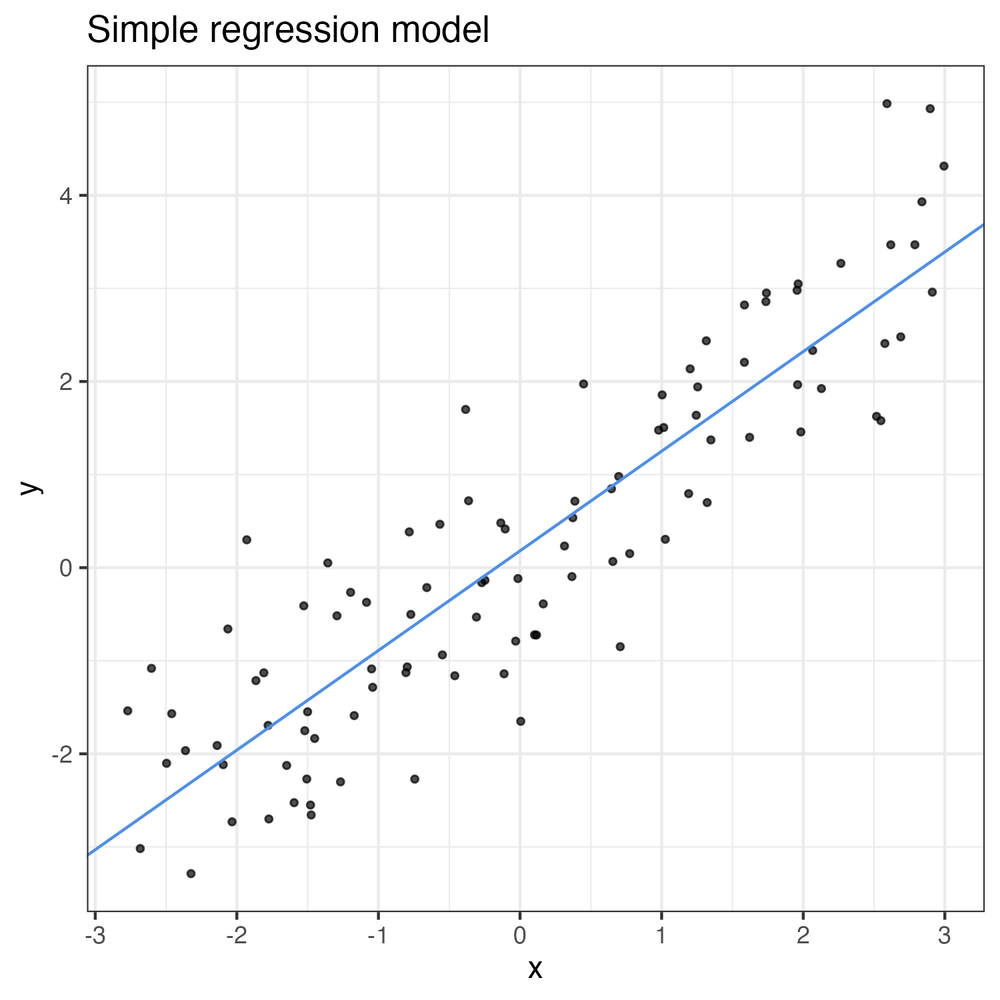

```{r setup, include = FALSE}
load("../data/model.RData")
```

## Introduction

This is a demo document that involves fitting a simple regression model
with simulated x-y data.


## Model

Information about the fitted model is below:

```{r regression}
summary(reg)
```


## Visualization

The figure below depicts a scatter plot with the fitted regression line.


